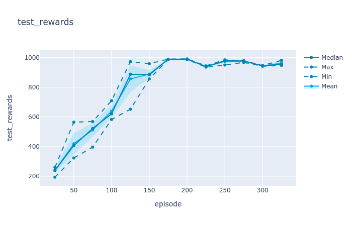
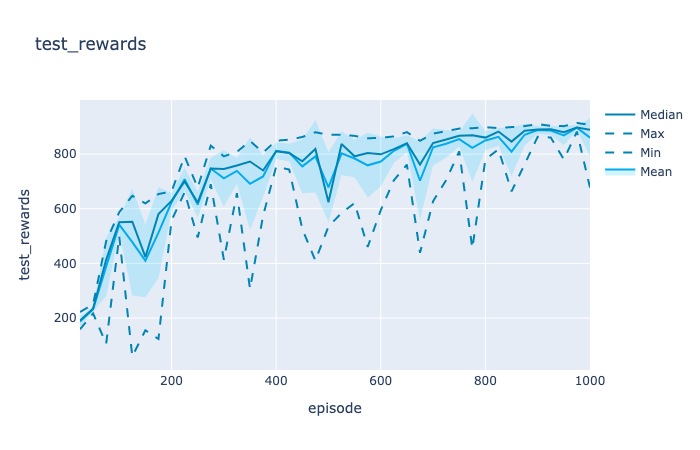
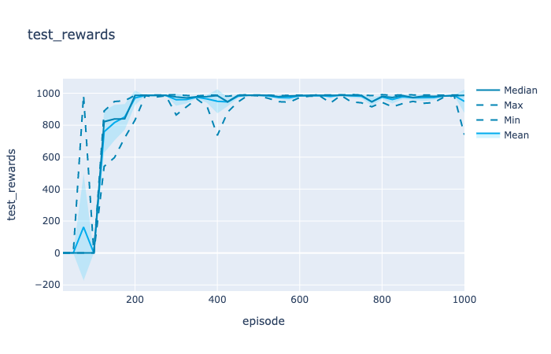
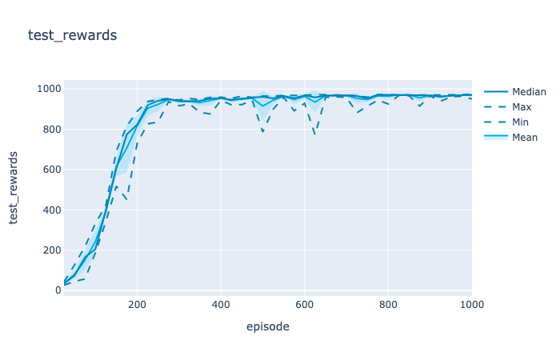

Dreamer
======

This is a Pytorch implementation of paper: [Dreamer to control: Learning Behaviors by Latent Imagination](https://danijar.com/project/dreamer/). **Get similar results compared with original Tensorflow implementation.** Tested on dm_control suite, with tasks cartpole-balance, cheetah-run, and ball-in-cup_catch. Testing on more tasks is ongoing.

Requirements
------------

- Python 3
- [DeepMind Control Suite](https://github.com/deepmind/dm_control)  
- [Gym](https://gym.openai.com/)
- [OpenCV Python](https://pypi.python.org/pypi/opencv-python)
- [Plotly](https://plot.ly/)
- [PyTorch >= v1.5.0](http://pytorch.org/)

To train the model:
------------
`python3 main.py --env [env-name]` 

More optional environments are listed in `env.py` . The code is only tested on dm_control suite. If you have any question, feel free to post issues.

## Some training results:

- cartpole-balance

  

- Cheetah-run

  

- Ball-in-cup_catch

  

- Walker-walk

  

References:
------------

[1] [Dream to Control: Learning Behaviors by Latent Imagination](https://arxiv.org/abs/1912.01603)  

[2] [Tensorflow implementation, with tensorflow1.0](https://github.com/google-research/dreamer)

[3] [Tensorflow implementation, with tensorflow2.0](https://github.com/danijar/dreamer)

[4] [Learning Latent Dynamics for Planning from Pixels](https://arxiv.org/abs/1811.04551)  

[5] PlaNet implementation from [@Kaixhin](https://github.com/Kaixhin) 

